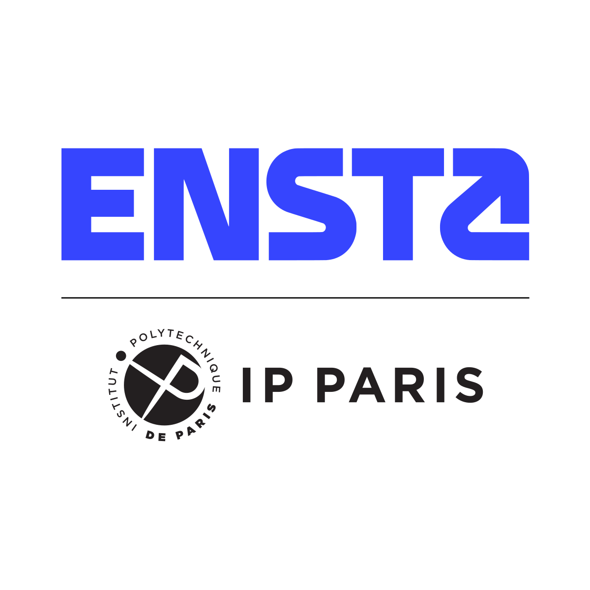
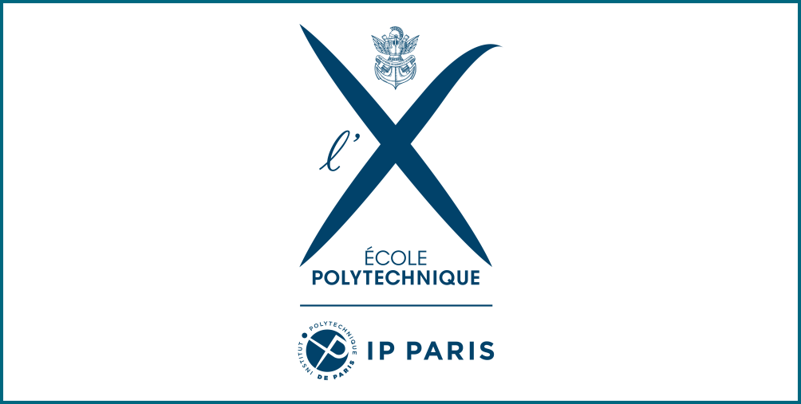
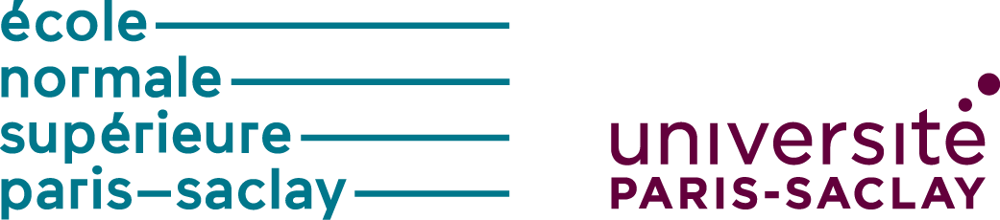

## Research appointments

:::: {.columns}

::: {.column width="30%"}

:::: {style='margin-top: -2em;'}
::::

{width="80%" fig-align="left"}

:::

::: {.column width="69%"}

:::: {style='margin-top: 4em;'}
::::

* **2026 - present** Assistant Professor at **[ENSTA](https://www.ensta.fr/chercheur)** within the *[Institut Polytechnique de Paris](https://www.ip-paris.fr/en)*.

:::
::::

:::: {.columns}

::: {.column width="30%"}

{width="80%" fig-align="left"}

:::

::: {.column width="69%"}

:::: {style='margin-top: 1em;'}
::::

* **2024 - 2025** Postdoctoral fellow at **[École polytechnique](https://www.polytechnique.edu/en)** in the LMS & **[MΞDISIM](https://m3disim.saclay.inria.fr/)** teams.
  * In collaboration with [Pr. Martin Genet](https://mgenet.github.io/)

:::
::::

## Education

:::: {.columns}

::: {.column width="30%"}

{width="80%" fig-align="left"}

:::

::: {.column width="69%"}

* **2020 - 2023** <a href="Resources/Documents/PhD_Thesis.pdf">PhD</a> in Computational mechanics 
  * **Title** [Towards an Optimal Multi-query Framework based on Model-order Reduction for Non-linear Dynamics](Resources/Documents/PhD_Thesis.pdf)
  * **At** [**Laboratoire de Mécanique Paris-Saclay**](https://lmps.ens-paris-saclay.fr/en/presentation) (UMR 9026, Université Paris-Saclay, CentraleSupélec, [**ENS Paris-Saclay**](https://ens-paris-saclay.fr/en), CNRS)  
  * **Supervision** [Pr. David Néron](https://lmps.ens-paris-saclay.fr/en/node/1215), Dr. A. Fau, Dr. PÉ Charbonnel

:::

::::

:::: {.columns}

::: {.column width="30%"}

{width="80%" fig-align="left"}

:::

::: {.column width="69%"}

* **2019 - 2020** Master of science (M2R) - [**École Normale Supérieure Paris-Saclay**](https://ens-paris-saclay.fr/en) / [**CentraleSupélec**](https://www.centralesupelec.fr/en) (MS2SC)  
  * **Thesis** Model reduction in non-linear dynamics for visco-plasticity problems
  * **At** [**Laboratoire de Mécanique Paris-Saclay**](https://lmps.ens-paris-saclay.fr/en/presentation) (UMR 9026, Université Paris-Saclay, CentraleSupélec, [**ENS Paris-Saclay**](https://ens-paris-saclay.fr/en), CNRS)  
  * **Supervision** [Pr. David Néron](https://lmps.ens-paris-saclay.fr/en/node/1215)
* **2018 - 2019** Scientific teaching qualification (agrégation de mécanique)  
* **2017 - 2018** Master of science (1) - [**École Normale Supérieure Paris-Saclay**](https://ens-paris-saclay.fr/en) (MMS)
  * **Thesis** Predicting the acoustic absorption of meta-materials using a combination of analytical and numerical approaches
  * **At** [**Trinity College, Dublin, Ireland**](https://www.tcd.ie/)
  * **Supervision** [Pr. Henry Rice](https://www.tcd.ie/mecheng/staff/hrice/)
  * **Research project** Loading step and arc-length adaptation methods for non-linear hyperelasticity computations
  * **Supervision** [Dr. Emmanuel Baranger](https://lmps.ens-paris-saclay.fr/fr/annuaire-des-personnes/emmanuel-baranger-0)
* **2016 - 2017** Bachelor&#039;s degree in Engineering - [**École Normale Supérieure Paris-Saclay**](https://ens-paris-saclay.fr/en)

:::

::::

* **2014 - 2016** MPSI-PSI* (Lycée Hoche, Versailles), Intensive two-year class of mathematics, physics and engineering sciences preparing for selective entrance examination to the French Grandes Ecoles 
* **2011 - 2014** Baccalauréat (A-levels) - with first class honours (Lycée Hoche, Versailles)

