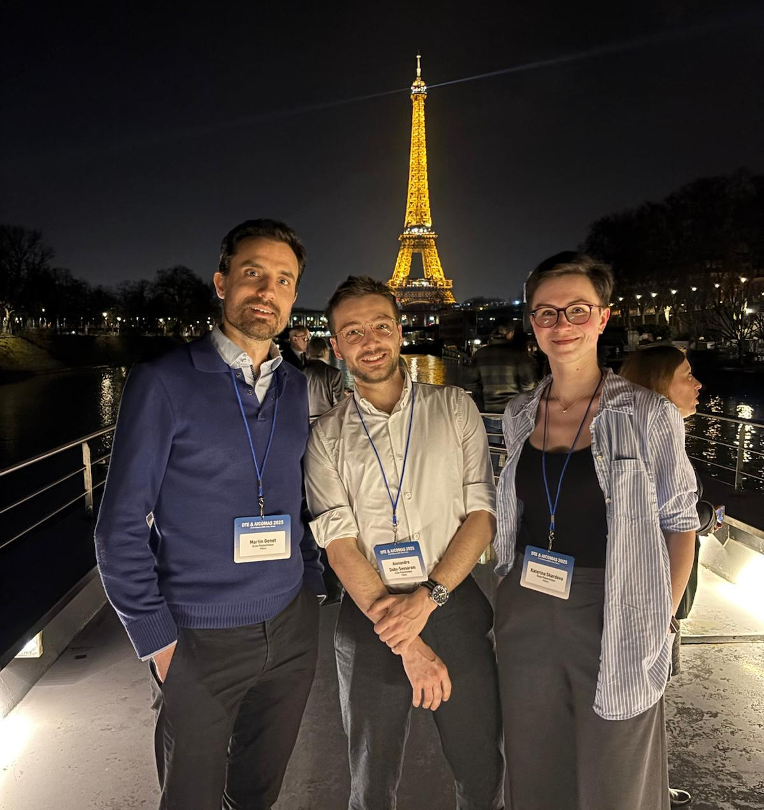

This week, my colleagues [Kateřina Škardová](https://m3disim.saclay.inria.fr/people/katerina-skardova) and [Martin Genet](https://mgenet.github.io/), and I attended the [2025 DTE-AICOMAS](https://dte_aicomas_2025.iacm.info/) conference. [Kateřina Škardová](https://m3disim.saclay.inria.fr/people/katerina-skardova) and I both presented our towards getting a real-time digital twin of the lungs [@daby-seesaramFiniteElementNeural2024;@skardovaFiniteElementNeural2024].

Meanwhile, [Martin Genet](https://mgenet.github.io/) chaired the mini-symposium [MS020 Digital twins of living systems: theoretical, implementation & application challenges](https://dte_aicomas_2025.iacm.info/event/area/8d4fc12b-710a-11ef-a6b7-000c29ddfc0c) he co-organised.

{width="75%" fig-align="center"}